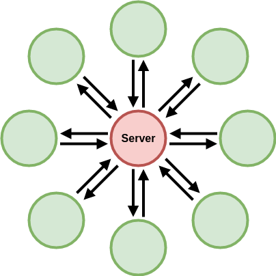

# Money On The Internet

Let's start off by building the most primitive form of digital currency. We are going to build a centralized bank.

Centralized systems are composed of two main parts: server and client. Server is the centralized part.

  

## Server

## Client
